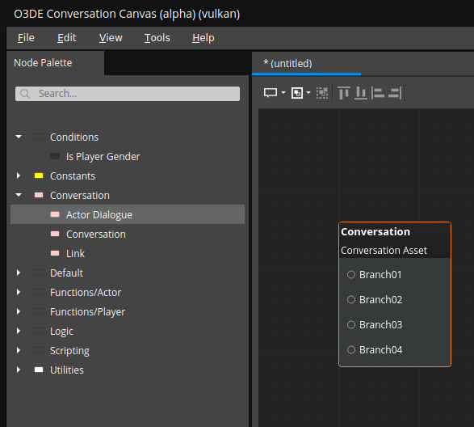
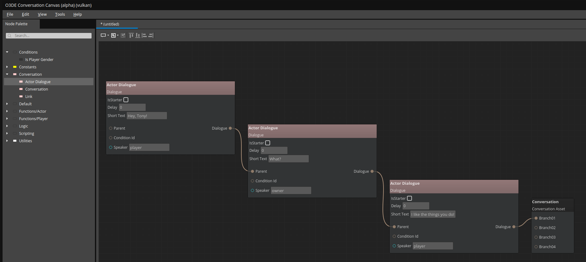

# O3DE Conversation System and Editor

A conversation system and editor for O3DE that aims to provide a simple way to create, preview, and use branching dialogue. Think YarnSpinner.

It is *__absolutely__* not ready to be used for anything production at this time as it is very much a work in progress.

#### Short term goals:
* An editor for creating and editing dialogue assets.
* Handle simple conditional checks to determine if a piece of dialogue is enabled.
* A simple UI for playing dialogue in the O3DE Editor
* Play a designated audio file for a piece of dialogue

#### Long term goals:
* After (hopefully) some feedback, formalize what functionality will be added.
* Design and implement a simple conversation programming language, similar to https://github.com/YarnSpinnerTool/YarnSpinner. 
* Allow importing [YarnSpinner](https://github.com/YarnSpinnerTool/YarnSpinner) (and potentially other) dialogue files
* Allow exporting to other file formats.
* I'd like it to be a tool that can be used to create and preview dialogues, even if you don't use O3DE as your engine.
* Play a conversation in the editor.

#### Fantasy:
* Allow the desired conversation programming language to be used to generate accompanying audio.
  * Think "Say "Hi there, earthling" (2 seconds)", and it generates a "Hi there, earthling" audio file where the text is said over a span of 2 seconds. Tags can be added throughout the text to specify gender, attitude, etc, and it'll use AI to (hopefully),generate a somewhat decent audio representation that can be used for prototyping dialogue.

Right now, I'm mostly creating a solid prototype without worrying too much about the long term and above. Once that's done, unit-tested, documented, and stable, I'll worry about making potentially significant changes/improvements.

I'm self-taught with no professional experience, so keep that in mind when you look at my code! After all the experimenting, there's bound to be some weird stuff in there. I would *love* constructive feedback. 

I used the [MaterialCanvas](https://github.com/o3de/o3de/tree/development/Gems/Atom/Tools/MaterialCanvas) in O3DE as a base for the current version.

#### Installing

1. Clone the repo
2. Add the gem to O3DE, and enable it for your project.
3. Rebuild, making sure the Conversation and Conversation.Editor targets are built.

# Launching the conversation editor

1. Open the same file directory that your project's executable is located.
2. Launch `ConversationCanvas` (Linux) or `ConversationCanvas.exe` (Windows)
  
# Using the conversation editor
I'm currently still experimenting with the workflow, but for now, it goes like this:

1. Drag a `Conversation/Conversation` (That's the heierarchy in the Node Palette on the left) node onto the graph.

2. Due to a limitation I haven't worked past yet, you'll need to make sure that each dialogue node follows a path that leads to the node you just created:

## Conditionals

Implemented, will document soon, but you can check out [PlayerGender](Assets/ConversationCanvas/GraphData/Nodes/Conditional/PlayerGender.conversationgraphnode) until then. It's just a test.